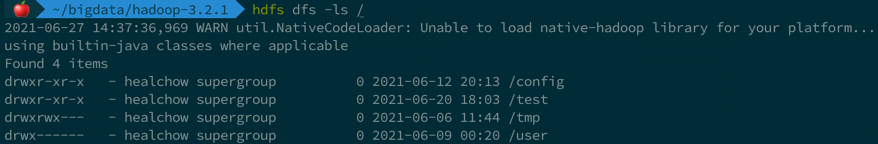
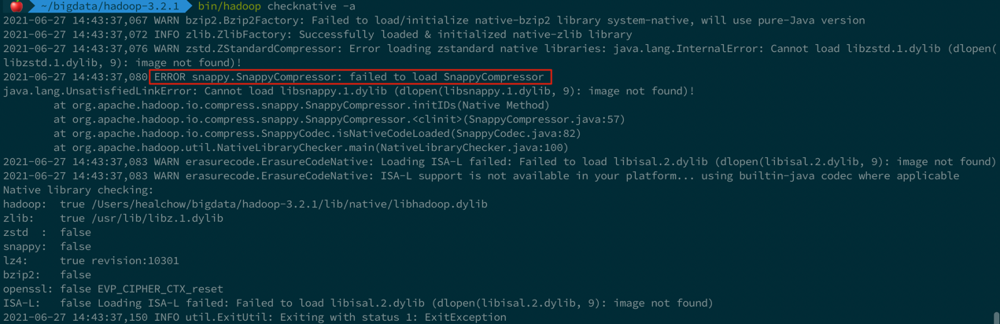

# Hadoop Native Library for macOS

这个仓库提供了一些 macOS 系统下的 Hadoop 本地库，可以消除在 macOS 下运行 Hadoop 程序时的警告：

```shell
WARN util.NativeCodeLoader: Unable to load native-hadoop library for your platform...
using builtin-java classes where applicable
```

## 使用方法

将 `hadoop-x.x.x/lib/native` 下的文件，替换到本地`${HADOOP_HOME}/lib/native` 中（删除原来的所有文件）。

不用重启 Hadoop 集群，即可验证警告消失（Hadoop-3.2.1 为例）：



查看 Hadoop 支持的本地库信息：

```shell
cd ${HADOOP_HOME}
bin/hadoop checknative -a

# 主要结果
Native library checking:
hadoop:  true /Users/healchow/bigdata/hadoop-3.2.1/lib/native/libhadoop.dylib
zlib:    true /usr/lib/libz.1.dylib
zstd  :  false
snappy:  false
lz4:     true revision:10301
bzip2:   false
openssl: false EVP_CIPHER_CTX_reset
ISA-L:   false Loading ISA-L failed: Failed to load libisal.2.dylib (dlopen(libisal.2.dylib, 9): image not found)
```



其中报错是因为本地没有 snappy 压缩相关的库，暂时忽略。
